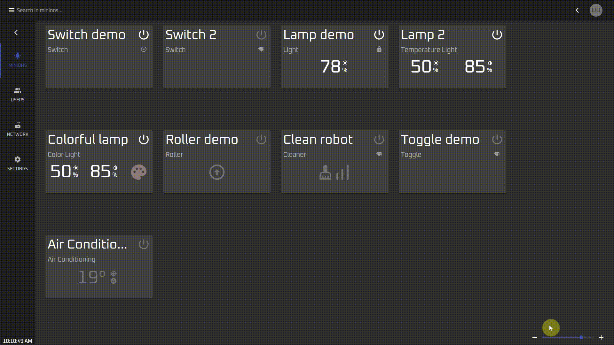

# The Casanet Dashboard V4

### A new react based modern hybrid dashboard for web &amp; mobile.

## ✨✨✨ [Live Demo Dashboard](https://demo.dashboard.casanet.casa/) ✨✨✨

The dashboard design to fully support the following features:
* Dark\light mode theme.
* Desktop, tablet, mobile and mobile app all fully supported.
* Multi-language with fully RTL support (using [i18n](https://react.i18next.com/)).

#### 💾 backward computability 💾

You can still use the [v3 dashboard](https://github.com/casanet/frontend-v3) (should be server in `CASANET-URL/v3` URL). 

## DEVELOPMENT

The dashboard implemented using [react v17](https://reactjs.org/blog/2020/10/20/react-v17.html) and [mui v5](https://mui.com/).

To set development environment, first set the environment variables, see [.env.example](./.env.example), then use the following commands:

* `yarn` - to install all dependencies
* `yarn run prebuild` - to fetch the [casanet server spec](https://github.com/casanet/casanet-server/blob/development/backend/src/swagger.json) and generate the API's calls using [Swagger online generate](https://generator3.swagger.io/index.html) API.
* `yarn run start` - to start the development assets server.
* `yarn run build` - To build the final bundle.

To build the mobile app using [cordova](https://cordova.apache.org/) first make sure you have installed [Android SDK](https://developer.android.com/studio) and [java 11 JDK](https://www.oracle.com/java/technologies/downloads/#java11) on your machine, then:

* `npm i -g cordova` - To install the cordova on the machine.
* `cordova platform add android` - Add the resources of cordova for Android. 
* `yarn run cordova:android` - To build & run the android app.

In order to debug app in realtime, connect the device to the PC, and open debug-mode, then go to `chrome://inspect/#devices` page.
